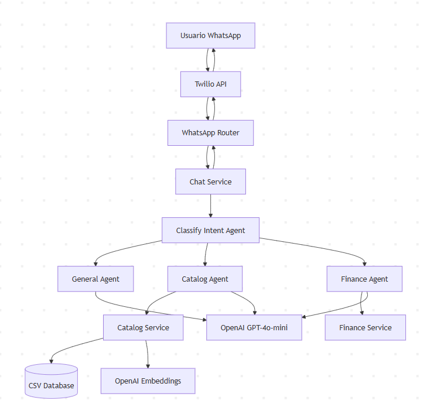

# Arquitectura del Sistema

## Índice

1. [Diagrama de Alto Nivel sobre Componentes y Arquitectura](#diagrama-de-componentes)
2. [Diagrama sobre Prompts/Arquitectura de Agentes/Tools](#arquitectura-de-agentes)
3. [Propuesta de Roadmap](#roadmap-de-producción)

## Diagrama de Componentes



## Componentes Principales

### API Layer
- **FastAPI Server**: Servidor HTTP en puerto 8000
- **WhatsApp Router**: Recibe webhooks de Twilio en `/api/whatsapp/webhook`
- **Chat Router**: API REST directa en `/api/chat`

### Service Layer
- **Chat Service**: Orquestador principal del flujo de conversación
- **Catalog Service**: Búsqueda semántica de vehículos usando embeddings
- **Finance Service**: Calculadora de financiamiento y mensualidades

### Agent Layer (LangGraph)
- **Classify Intent Agent**: Router que clasifica la intención del usuario
- **General Agent**: Responde preguntas generales sobre Kavak
- **Catalog Agent**: Busca vehículos según criterios del usuario
- **Finance Agent**: Calcula planes de pago y financiamiento

### Data Layer
- **CSV Catalog**: Base de datos de vehículos disponibles
- **Agent State**: Memoria de conversación en memoria

## Flujo de un Mensaje

```
Usuario → Twilio → WhatsApp Router → Chat Service → Clasificador → Agente → Respuesta
```

1. Usuario envía mensaje por WhatsApp
2. Twilio recibe el mensaje y hace POST a `/api/whatsapp/webhook`
3. WhatsApp Router procesa el mensaje
4. Chat Service recibe la query y la envía al Classify Intent Agent
5. El agente clasificador determina la intención (GENERAL, CATALOG_SEARCH, FINANCE_CALCULATION)
6. Se enruta al agente especializado correspondiente
7. El agente procesa y genera respuesta usando OpenAI
8. La respuesta se envía de vuelta por Twilio al usuario

## Arquitectura de Agentes

### 1. Classify Intent Agent (Router)

Clasifica la intención del usuario en 3 categorías:
- GENERAL: Preguntas sobre Kavak
- CATALOG_SEARCH: Búsqueda de autos
- FINANCE_CALCULATION: Cálculos de financiamiento

**Prompt**:
```
Clasifica la consulta en: GENERAL, CATALOG_SEARCH o FINANCE_CALCULATION

Ejemplos:
- "¿Qué garantía ofrecen?" → GENERAL
- "Quiero un Honda Civic" → CATALOG_SEARCH
- "¿Cuánto pagaría mensualmente?" → FINANCE_CALCULATION
```

**Configuración**: GPT-4o-mini, temperature=0

### 2. General Agent

Responde preguntas sobre Kavak: garantía, proceso de compra, servicios.

**Prompt**:
```
Eres agente de Kavak. Información clave:
- Garantía: 3 meses o 3,000 km
- Periodo de prueba: 7 días
- Certificación: +200 puntos de inspección
- Proceso 100% digital
- Entrega a domicilio gratis
- Financiamiento: 10% anual, 3-6 años
```

**Configuración**: GPT-4o-mini, temperature=0.2

**Ejemplo**:
```
Input: "¿Cuál es el periodo de prueba?"
Output: "Tienes 7 días para probar el auto. Si no te convence, lo devuelves sin problema."
```

### 3. Catalog Agent

Busca autos en el catálogo usando búsqueda semántica.

**Prompt**:
```
Eres vendedor de Kavak. Recomienda autos del catálogo.
Destaca precio, kilometraje y características.
Todos incluyen garantía y 7 días de prueba.
```

**Tool: Búsqueda Semántica**
1. Genera embedding de la query (OpenAI text-embedding-3-small)
2. Compara con embeddings del catálogo (cosine similarity)
3. Retorna top 3 autos más relevantes

**Configuración**: GPT-4o-mini, temperature=0.2

**Ejemplo**:
```
Input: "Auto familiar con tecnología"
Búsqueda: Honda CR-V 2021, Mazda CX-5 2020, Toyota RAV4 2019
Output: "Te recomiendo estas 3 opciones:
- Honda CR-V 2021: $450,000, 35,000 km, Bluetooth y CarPlay
- Mazda CX-5 2020: $420,000, 42,000 km, Bluetooth y CarPlay
- Toyota RAV4 2019: $410,000, 48,000 km, Bluetooth"
```

### 4. Finance Agent

Calcula planes de financiamiento extrayendo parámetros del mensaje.

**Proceso**:
1. LLM extrae: precio, enganche, años
2. Calcula mensualidad con fórmula de amortización
3. Formatea plan completo

**Fórmula**:
```
M = P * [r(1+r)^n] / [(1+r)^n - 1]
Donde: M=mensualidad, P=monto financiado, r=tasa mensual, n=meses
```

**Configuración**: GPT-4o-mini, temperature=0, tasa fija 10% anual

**Ejemplo**:
```
Input: "Auto de $300,000 con $60,000 de enganche a 5 años"

Extracción: {"precio": 300000, "enganche": 60000, "years": 5}

Output:
"Plan de Financiamiento:
- Precio: $300,000
- Enganche: $60,000
- Financiado: $240,000
- Plazo: 5 años (60 meses)
- Mensualidad: $5,099.79
- Total: $305,987.40
- Intereses: $65,987.40"
```

## Stack Tecnológico

- **Web Framework**: FastAPI
- **Server**: Uvicorn
- **Agent Orchestration**: LangGraph
- **LLM**: OpenAI GPT-4o-mini
- **Embeddings**: OpenAI text-embedding-3-small
- **Data**: Pandas, NumPy
- **Similarity Search**: Scikit-learn
- **WhatsApp**: Twilio
- **Container**: Docker

## Roadmap de Producción

### 1. Deploy en AWS

**Infraestructura**
- Contenedores en ECS Fargate con auto-scaling
- Imágenes en ECR (Elastic Container Registry)
- Load balancer para distribución de tráfico
- Deploy automático desde GitHub Actions

**Base de Datos**: PostgreSQL en AWS RDS   
**Cache** : Redis en AWS ElastiCache   
**Secrets**: AWS Secrets Manager para API keys

**Seguridad**
- Validación de firma de Twilio webhook
- Rate limiting (10 requests/minuto)
- HTTPS obligatorio

**Monitoreo**: AWS CloudWatch para logs, métricas y alertas

### 2. Evaluación de Desempeño

**Métricas Técnicas**
- Latencia por agente
- Accuracy del clasificador (target > 95%)
- Costos por mensaje

**Dashboard en CloudWatch**
- Total mensajes/día
- Error rate
- Costo total

### 3. Testing y Regression

**Tests Automáticos**
- Tests unitarios para cada agente
- Tests de integración end-to-end
- Ejecutar en CI/CD antes de cada deploy
- Cobertura de código > 80%

**Golden Dataset**: 50+ casos de prueba con resultados esperados

**Regression Testing**: Comparar nueva versión con 100 conversaciones históricas

**Deploy Gradual**
1. 10% tráfico → Monitorear 1 hora
2. Si OK → 50% → Monitorear 1 hora  
3. Si OK → 100%
4. Si falla → Rollback automático

### Timeline de Implementación

**Semana 1-2**: PostgreSQL + Redis + CI/CD  
**Semana 3-4**: Logging + Métricas + Alertas  
**Semana 5-6**: Tests + Golden dataset  
**Semana 7-8**: Deploy producción
